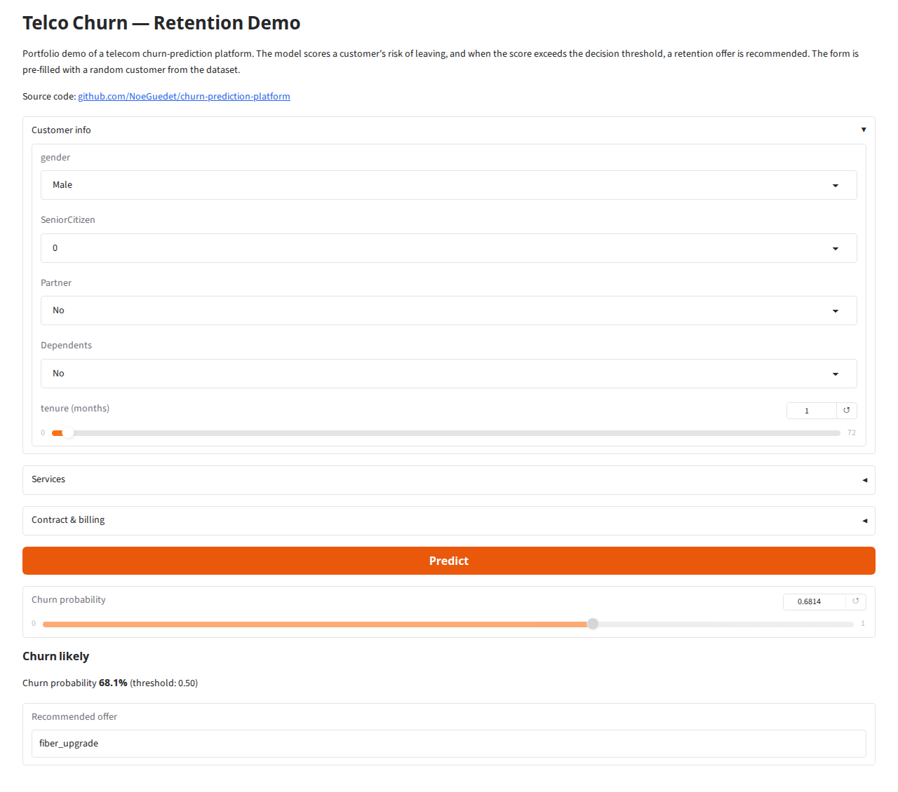
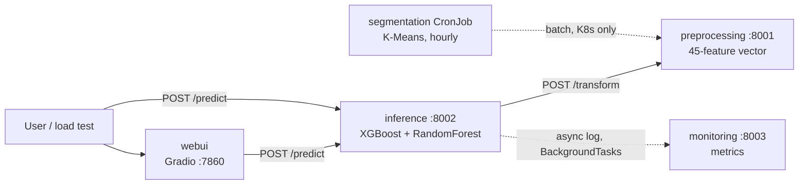

# Churn Prediction Platform

End-to-end ML platform for telecom churn prediction: a multi-service FastAPI pipeline engineered to run under a strict Kubernetes resource quota, with a Gradio demo UI, conditional model routing, off-critical-path monitoring and a full load-test harness.

[](https://github.com/NoeGuedet/churn-prediction-platform/actions/workflows/ci.yml)


> This project started as a school assignment on ML orchestration under resource constraints, and was polished into a portfolio piece: translated to English, extended with a web UI and hardened for public deployment.

**[Live demo](https://churn-prediction.noeguedet.fr)** — try the model with a random customer profile.



## What it does

Given a telecom customer profile, the platform predicts a churn probability with an XGBoost model. If the score exceeds a configurable threshold, a second model (RandomForest) recommends a retention offer among 5 categories. Every request is logged asynchronously to a monitoring service exposing volume, latency and error-rate metrics.

## Architecture



- **preprocessing** — transforms a raw customer profile into the 45-feature vector expected by the models (compiled version of the fitted sklearn pipeline, ~50× faster per row).
- **inference** — scores churn, conditionally routes to the offer model, logs off the critical path.
- **monitoring** — in-memory, bounded event store; exposes `GET /metrics`.
- **webui** — thin Gradio client of the inference API.
- **segmentation** — hourly K-Means batch job (Kubernetes CronJob only).

## Key engineering points

- **Designed for a hard quota**: the whole platform fits in **2500m CPU / 1.5Gi memory** (K8s ResourceQuota + LimitRange). Sizing was driven by `kubectl top` measurements, not guesses — see [ADR.md](ADR.md).
- **Off-critical-path monitoring**: predictions are logged via FastAPI `BackgroundTasks`; a monitoring outage cannot slow down or break a prediction.
- **Conditional model routing**: the offer model is only invoked when the churn score crosses the threshold (mock-verified in tests).
- **Compiled preprocessing**: the fitted `ColumnTransformer` is re-implemented as dict lookups + numpy at service startup, cutting per-request transform cost from ~10 ms to ~0.2 ms, with strict equivalence proven by test.
- **Battle-tested under load**: 12,638 HTTP 200 in 5 minutes at 3000 req/min, 100% success, zero pod restarts — full report in [STRESS_TEST.md](STRESS_TEST.md).
- **Kubernetes / Docker Compose parity**: the same images run in both, with requests/limits mirroring each other.

## Quickstart (Docker Compose)

```bash
git clone git@github.com:NoeGuedet/churn-prediction-platform.git
cd churn-prediction-platform
docker compose up --build -d
```

- Web UI: http://localhost:7860
- Inference API: `curl http://localhost:8002/health`
- Metrics: `curl http://localhost:8003/metrics`

## Kubernetes (minikube)

```bash
minikube start --cpus=4 --memory=6144 --driver=docker
minikube addons enable metrics-server

# Images are not published to any registry: build them inside minikube's Docker
eval $(minikube docker-env)
docker compose build
docker build -f services/segmentation/Dockerfile -t churn-prediction-platform/segmentation:1.0.0 .

kubectl apply -f k8s/ -n churn-prediction-platform
kubectl port-forward svc/inference-svc 8002:8002 -n churn-prediction-platform &
```

Note: on a fresh cluster, if some resources report `namespace not found` (the namespace is still initializing), simply re-run the same command — it is idempotent.

## Load testing

```bash
pip install -r requirements-dev.txt
python scripts/load_test.py --level stress --url http://localhost:8002/predict
# levels: nominal (10/min), charge (50/min), stress (150/min), extreme (--rate N)
```

Live resource usage during a run:

```bash
kubectl top pods -n churn-prediction-platform
kubectl port-forward svc/monitoring-svc 8003:8003 -n churn-prediction-platform &
curl http://localhost:8003/metrics
```

## Tests

```bash
python3 -m venv .venv && source .venv/bin/activate
pip install -r requirements-dev.txt -r services/preprocessing/requirements.txt -r services/inference/requirements.txt
pytest            # coverage >= 80% enforced (currently ~98%)
```

## Project structure

```
├── .github/workflows/   # CI/CD: tests (coverage gate) then multi-arch image builds
├── services/            # preprocessing / inference / monitoring / webui / segmentation
├── models/              # Trained artifacts + validation sheets (models/README.md)
├── k8s/                 # Kubernetes manifests (namespace, quota, limitrange, cronjob)
├── scripts/             # train_models.py, load_test.py, analyze_threshold.py
├── tests/               # pytest suite (coverage >= 80%)
├── data/                # IBM Telco churn dataset (public)
├── docs/                # Benchmark captures and figures
├── ADR.md               # Architecture Decision Record
├── STRESS_TEST.md       # Load & stress test report
├── PROJECT_NOTES.md     # In-depth engineering notes (benchmarks, incidents, lessons)
└── DEPLOYMENT.md        # Production deployment guide (VM + Caddy)
```

## Documentation

- [ADR.md](ADR.md) — why the architecture is shaped this way (quota-driven decisions)
- [STRESS_TEST.md](STRESS_TEST.md) — load test methodology and results
- [PROJECT_NOTES.md](PROJECT_NOTES.md) — deep dive: concepts, sizing math, incidents and lessons learned
- [DEPLOYMENT.md](DEPLOYMENT.md) — deploy on your own server with Docker Compose + Caddy
- [models/README.md](models/README.md) — model validation sheets (churn AUC 0.838, offer accuracy 0.928)

## Credits

- Dataset: [IBM Telco Customer Churn](https://www.kaggle.com/datasets/blastchar/telco-customer-churn) (public, fictional data).
- The load test script in `scripts/load_test.py` is an English, churn-focused rewrite of a generic load-testing script originally provided as coursework material.

## License

MIT — see [LICENSE](LICENSE).
